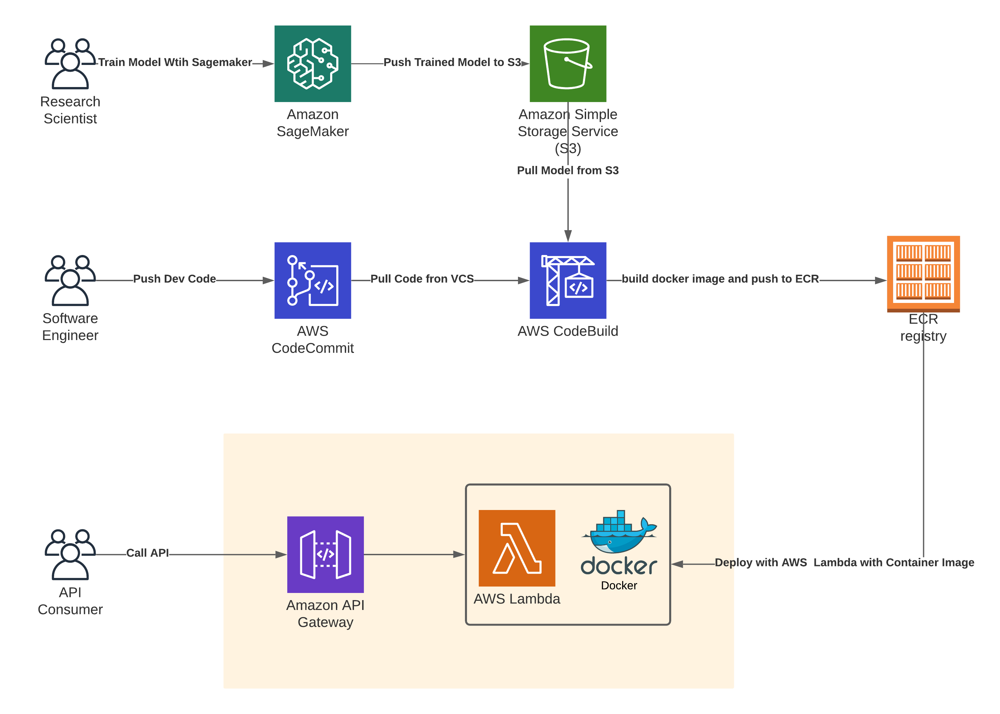

## Serverless Word Embedding

This project is supposed to present a way to use AWS Lambda with Amazon API Gateway to build a Serverless Word embedding
and related Solutions.

```shell
.
├── Dockerfile  ---- The dockerfile to build a image for AWS Lambda 
├── inference.py  ---- The main inference function 
├── mock_event.json ----  A mocked event send to AWS Lambda behind Amazoon API Gateway
├── model_downloader.py ----  The script to download pretrained model
└── requirements.txt  ----  The Python package requirements file
```

### Solution Overview

This project contained all files you need to create a docker image hosted in AWS Lambda. You could use this project to
build a docker image, push to Amazon Elastic Container Registry and deploy with your own AWS Lambda Environment. A
sample Machine Learning on AWS Tech stack is described as below. This project will mainly focus on the inference, build,
and deployment part

### Sample Arch Diagram



### Supported Methods

1. getVec: return the vector of a given word
2. getSim: return a similar word list of the given word(10 result by default)
3. getSimBetween: return the similarity of the two given words

### Sample API Call

Sample API Call:

```shell
#!/bin/bash
export yourEndpoint= "yourAmazonAPIEndpoint"
curl -X GET "https://${yourEndpoint}.execute-api.us-east-2.amazonaws.com/default/wordEmbed?method=getSimBetween&wordString=car&wordString=benz"
curl -X GET "https://${yourEndpoint}.execute-api.us-east-2.amazonaws.com/default/wordEmbed?method=getSim&wordString=car" 
curl -X GET "https://${yourEndpoint}.execute-api.us-east-2.amazonaws.com/default/wordEmbed?method=getSim&wordString=flower"
```

Sample response:

```shell
{"status_code": "0000", "similarity": "0.39729205"}
{"status_code": "0000", "sim_words": [["cars", 0.7827162146568298], ["vehicle", 0.7655367851257324], ["truck", 0.7350621819496155], ["driver", 0.7114784717559814], ["driving", 0.6442225575447083], ["vehicles", 0.6328005194664001], ["motorcycle", 0.6022513508796692], ["automobile", 0.595572829246521], ["parked", 0.5910030603408813], ["drivers", 0.5778359770774841]]}
{"status_code": "0000", "sim_words": [["flowers", 0.700128972530365], ["petals", 0.5507511496543884], ["floral", 0.5470587015151978], ["blossoms", 0.5127416849136353], ["fruit", 0.501261293888092], ["flowering", 0.5010757446289062], ["roses", 0.5008191466331482], ["buds", 0.4907474219799042], ["blooms", 0.47430336475372314], ["lavender", 0.47190049290657043]]}%
```

### Test warmed Env event metric on AWS Lambda

For a getSim request:

- Duration: 33.87 ms
- Billed Duration: 34 ms
- Memory Size: 3008 MB
- Max Memory Used: 1946 MB

For a getVec request:

- Duration: 1.35 ms
- Billed Duration: 2 ms
- Memory Size: 3008 MB
- Max Memory Used: 1946 MB

For a getSimBetween request:

- Duration: 1.07 ms
- Billed Duration: 2 ms
- Memory Size: 3008 MB
- Max Memory Used: 1946 MB

### Test locally

You could change the value of `multiValueQueryStringParameters` in the mock_event.json to mock a request and run the
inference function. The inference.py will automatically parse this as a request to run.

### Todo

- Add buildspec file for CI automation on AWS CodeBuild
- Add Swagger definitions file for better API description

## Security

See [CONTRIBUTING](CONTRIBUTING.md#security-issue-notifications) for more information.

## License

This library is licensed under the MIT-0 License. See the LICENSE file.

